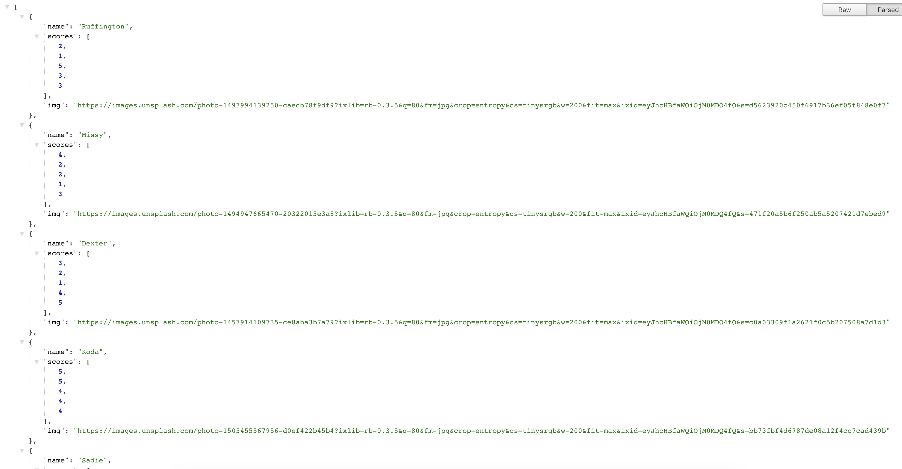

# Dog Pal Finder

Dog Pal Finder is the best way to find your furry best friend a furry best friend of their own! Enter in a few details about your dog and out pops their new pal.

## Tech
- HTML
- CSS
- Javascript/jQuery
- Node.js
- Node Packages
 - [express](https://www.npmjs.com/package/express) - Node web framework
 - [request](https://www.npmjs.com/package/request) - For API calls
- [UIkit](https://getuikit.com/) - CSS Framework
- [Unsplash API](https://unsplash.com/developers) - Stock photos

## API
Dog Pal Finder includes an easy to use API.

Endpoint: '/api/pals'

This endpoint will return a json object that includes the entire dataset that Dog Pal Finder has.

Note: no API key is required.

## Author
Craig Melville
